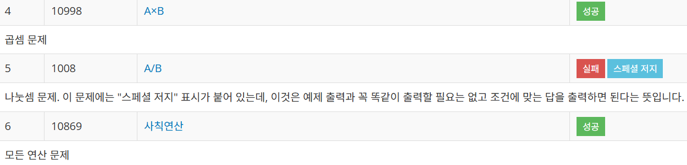
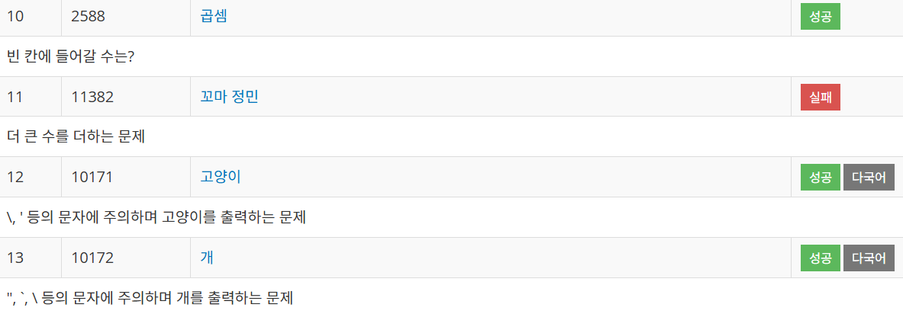
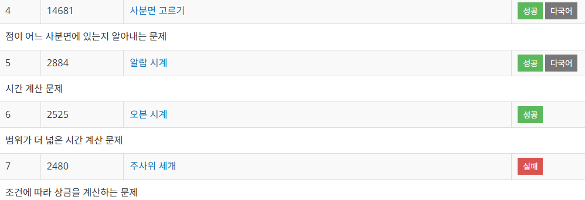

## 백준 With C

----------

- 1 단계 문제 해결 시작.
- 2024 / 11 / 22 : 3문제 해결
- 

----------

- 2024 / 11 / 23 : 3문제 해결 (1008번 나누기 문제는 나누기 특징에 대해 공부가 조금 더 필요할 듯 하다.)
- 

----------

- 2024 / 11 / 24 : 3문제 해결
- 

----------

- 2024 / 12 / 01 : 4문제 해결
- 
- ", `, \ 등의 문자를 출력하기 위해서는 해당 문자 앞에 \를 붙이면 출력할 수 있다.
- 1 단계 문제 모두 해결.

----------

- 2024 / 12 / 12 : 3문제 해결
- 
- 2 단계 문제 시작.

----------

- 2024 / 12 / 15 : 4문제 해결
- 
- 2 단계 문제 마무리.

----------