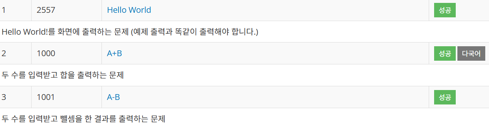
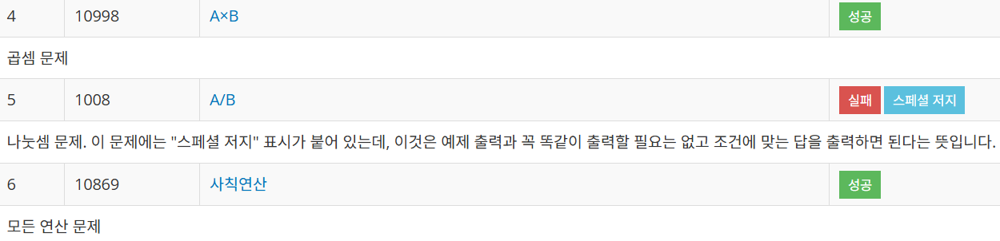
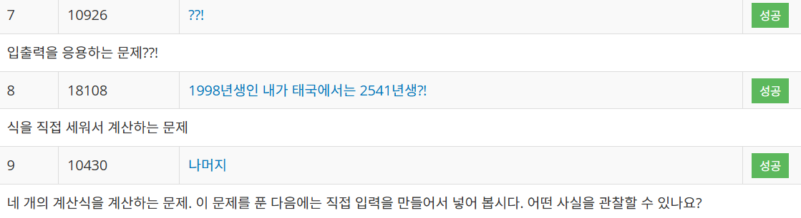

----------
# coding_study
----------

* 가능한 백준, 프로그래머스 사이트에서 3문제씩 해결하기.
* png/ 으로 이미지 파일 루트 맞추기.
* 개인 공부 코딩은 README 밑에 추가하여 작성.

## 백준

- 2024 / 11 / 22 : 3문제 해결
- 

- 2024 / 11 / 23 : 3문제 해결 (1008번 나누기 문제는 나누기 특징에 대해 공부가 조금 더 필요할 듯 하다.)
- 

- 2024 / 11 / 24 : 3문제 해결
- 

## 프로그래머스

- 2024 / 11 / 22 : 3문제 해결
- 

- 2024 / 11 / 23 : 3문제 해결
- 

- 2024 / 11 / 24 : 3문제 해결
- 
----------